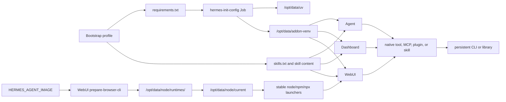

# Persistent software and addon architecture

## Purpose

Kubernetes containers are replaceable. Software installed into a running container's root filesystem disappears when that Pod is recreated. This installer therefore separates software into explicit ownership and persistence layers instead of treating an interactive package install as durable state.

The model answers three different questions:

1. **Where does the software come from and how does it survive?**
2. **Which Hermes component executes it?**
3. **How does Hermes know when and how to use it?**

Making a binary or Python module available solves only the first question. A native Hermes tool, MCP server, plugin, or skill normally answers the third.

## Architecture at a glance



## Software layers and guarantees

| Layer | Location | Who manages it | Who uses it | Persistence and lifecycle |
|---|---|---|---|---|
| Agent application runtime | `/opt/hermes`, `/opt/hermes/.venv`, image filesystem | Agent container image | Agent and Dashboard processes | Image-owned and replaced with the image. Do not install addons into this environment. |
| Persistent Python toolchain | `/opt/data/uv` | Installer init Job | Installer and all Hermes application containers through `PATH` | PVC-backed and rebuildable. The configured Python version is installed by `uv`. |
| Persistent Python addons | `/opt/data/addon-venv` | Installer from profile or operator requirements | Agent, Dashboard, WebUI, skills, and scripts | PVC-backed and shared. `install.sh` additively installs or upgrades declarations; it does not prune undeclared packages or remove the venv when requirements are disabled. |
| Agent/Dashboard Node runtime | Agent image paths such as `/usr/local/bin` | Agent image | Agent and Dashboard | Image-owned. Its version follows `HERMES_AGENT_IMAGE`. |
| Managed WebUI Node/npm/npx runtime | `/opt/data/node/runtimes/<hash>`, `/opt/data/node/current`, `/opt/data/node/bin` | WebUI `prepare-browser-cli` init container | WebUI tool execution, including the browser controller | PVC-backed but rebuildable. A complete candidate is validated before atomic activation; corrupt or incomplete generations are repaired from the Agent image. |
| WebUI Agent dependency link | `/opt/data/node_modules` | WebUI `prepare-browser-cli` | WebUI Node-based Hermes tooling | The PVC stores a symlink; its target is recreated in the Pod-local Agent-source `emptyDir` on every WebUI Pod creation. It is not a persistent third-party package installation. |
| npm/npx cache | `/opt/data/.npm` | npm/npx | Agent and WebUI invocations | PVC-backed cache and package state. It improves repeat execution but is not a declarative installed-package contract. |
| User-local executables | `/opt/data/.local/bin` | Operator, a reviewed skill, or application tooling | Agent, Dashboard, WebUI when on `PATH` | Persistent but operator-managed. The installer does not verify provenance or recreate arbitrary files placed here. |
| Project dependencies | Under `/workspace/<project>` | Project tooling and lock files | Commands executed in that project | PVC-backed with the workspace. They belong to that project and are not automatically shared as an installer-managed runtime. |
| Native libraries and OS packages | Container image filesystem | Custom image build | Whichever container uses the image | Must be baked into a custom image. Interactive `apt`, `dnf`, or equivalent installs in a running Pod are not persistent. |
| Skills and plugins | `/opt/data/skills`, `/opt/data/plugins` | Bootstrap profile, operator, or Hermes | Hermes runtime | Persistent behavior and integration code. They do not by themselves install every external dependency. |

## Who uses the persistent software?

### Hermes Agent

The Agent is the primary executor for terminal commands, skills, plugins, and native tools. It can use:

- Python commands from `/opt/data/addon-venv/bin`;
- `uv` from `/opt/data/uv/bin`;
- user-local commands from `/opt/data/.local/bin`;
- Node/npm/npx supplied by the Agent image;
- project-local tools under `/workspace` when invoked in the correct project directory.

### Hermes Dashboard

Dashboard uses the same Agent image and mounts the same home and workspace PVCs. It receives the persistent addon Python and user-local paths so Dashboard-originated operations can use the same Python CLI layer. Its Node runtime remains image-owned.

### Hermes WebUI

WebUI chat sessions execute Hermes tooling inside the WebUI container, not remotely inside the Agent container. WebUI therefore needs both:

- the shared Python addon environment; and
- the installer-managed Node/npm/npx runtime under `/opt/data/node` for Node-based tooling such as `agent-browser`.

This is why the WebUI Node runtime is copied, validated, and activated separately even though Agent and Dashboard already use the Agent image's Node installation.

### Browserless

Browserless is an internal Chromium/CDP service. It does not mount the Hermes home or workspace PVC and does not consume the Python addon venv or managed Node runtime. Hermes clients reach it over the internal token-protected Service.

### Init containers and Jobs

The one-shot init Job builds or updates declarative Python addons and prepares persistent state. WebUI's `prepare-browser-cli` init container reconciles the managed Node runtime. These are provisioning actors, not user-facing consumers.

## Does Hermes need a skill to use an addon?

Usually **yes**, unless the software is already exposed through a native Hermes tool, configured MCP server, or plugin.

Software availability and Agent behavior are separate:

| Situation | Is a skill needed? | Recommended integration |
|---|---:|---|
| Hermes already has a native tool for the capability | No | Configure and use the native tool. |
| The software exposes an MCP server | Not necessarily | Configure the MCP server; optionally add a skill for organization-specific workflows. |
| A stable CLI should be used from natural-language requests | Usually | Add a skill describing triggers, exact commands, inputs, outputs, safety boundaries, and verification. |
| A Python library supports a reusable workflow | Usually | Put a reviewed script beside the skill and declare the library in profile/operator requirements. The skill invokes the script. |
| A one-off project command is run manually | No | Run it in the project workspace; do not pretend it is a reusable Agent capability. |
| A complex application needs services, native libraries, or daemons | A skill alone is insufficient | Build a custom image or deploy a separate service, then expose a tool/MCP/skill interface. |

A useful profile therefore composes **both** sides:

```text
profile/
├── requirements.txt       # Python runtime dependencies
├── skills.txt             # selected reusable procedures
├── skills/                # optional profile-local skill content
└── defaults.conf          # profile defaults
```

For example, installing a PDF library makes imports possible; a Markdown-to-PDF skill tells Hermes when to render, which script to call, where to write the PDF, and how to verify the result.

## Python addons: supported declarative workflow

Each bundled profile can select a `requirements.txt`. An operator can override it:

```bash
HERMES_ADDON_REQUIREMENTS=./requirements.txt
HERMES_ADDON_PYTHON_VERSION=3.13
ENV_FILE=./hermes.env ./install.sh
```

The init Job:

1. installs or reuses `uv` under `/opt/data/uv`;
2. installs the configured Python version under the same PVC-backed toolchain;
3. creates or migrates `/opt/data/addon-venv`;
4. installs the declared requirements; and
5. makes its `bin` directory available to Agent, Dashboard, WebUI, and terminal subprocesses.

Pin versions and hashes according to your supply-chain policy. Rerunning `install.sh` installs or upgrades the current requirements, but the operation is not an exact environment synchronization:

- packages removed from requirements are not automatically uninstalled;
- `HERMES_ADDON_REQUIREMENTS=` skips addon installation but leaves an existing venv and its packages on the PVC and `PATH`;
- changing `HERMES_ADDON_PYTHON_VERSION` installs that managed Python but does not rebuild a healthy venv that already carries the installer marker; and
- manual `pip install` changes persist until explicitly removed or the venv is rebuilt.

Requirements are therefore the supported reproducibility input, not an exact-pruning package lock. The installer currently has no dedicated prune/rebuild command. If exact convergence or interpreter migration is required, treat rebuilding `/opt/data/addon-venv` as a controlled maintenance operation with backup and rollback, or use a custom image. Prefer requirements for anything operationally required.

Do not install packages into `/opt/hermes/.venv`; that environment belongs to the image and can be replaced on every rollout.

## Node.js, npm, and npx

Node.js, npm, and npx are always-on infrastructure. There is no `HERMES_NPX_SETUP` feature toggle in current releases.

### Agent and Dashboard

Agent and Dashboard use the Node runtime shipped in `HERMES_AGENT_IMAGE`. Upgrading or replacing that image changes their image-owned runtime.

### WebUI managed runtime

The WebUI image does not carry the complete Agent Node toolchain. Before WebUI starts, `prepare-browser-cli`:

1. reads Node and npm from `HERMES_AGENT_IMAGE`;
2. computes content hashes for Node, npm, and any required private library;
3. builds a candidate under `/opt/data/node/runtimes/<hash>`;
4. validates Node, npm, and npx before publication;
5. atomically points `/opt/data/node/current` at the complete runtime;
6. installs stable launchers under `/opt/data/node/bin`; and
7. keeps at most the active and previous validated generations for repair or rollback.

Persistence here means the validated generation survives Pod replacement. It does **not** make that generation permanently immutable: an image change, missing execute bit, corrupt payload, invalid pointer, or failed integrity check causes controlled repair or replacement.

### npm/npx cache is not a package declaration

`/opt/data/.npm` persists npm/npx cache data and `npm_config_yes=true` avoids interactive confirmation. This supports on-demand `npx` workflows, but a warm cache is not a reliable software inventory.

For a repeatable Node-based capability, choose one of these models:

1. use `npx --yes package@pinned-version` from a skill and accept its on-demand/cache lifecycle;
2. store a project with `package.json` and a lock file under `/workspace`, then install and run it as project-local software; or
3. build a custom Agent/WebUI image when the package and native dependencies must be guaranteed at image startup.

Do not rely on `npm install -g` in the container's default global prefix. That location may be image-owned, read-only, or lost on Pod replacement. The installer does not currently manage a declarative global npm package set on the PVC.

## Native packages and custom images

PVC persistence cannot safely replace an operating-system package manager. Use custom images for:

- shared libraries and dynamic-loader dependencies;
- `apt`, `dnf`, or other OS packages;
- daemons and background services;
- kernel- or architecture-specific tools;
- software that must be present before PVC initialization; and
- organization-approved, vulnerability-scanned runtime baselines.

Pin image references for controlled production upgrades. Validate custom WebUI images because their inherited loader environment is preserved and must remain compatible with the installer-managed Node launcher.

Configure reviewed image references in `hermes.env`, then use the normal reconciliation path:

```bash
cat >> hermes.env <<'EOF'
HERMES_AGENT_IMAGE=registry.example.com/hermes-agent:reviewed-version
HERMES_WEBUI_IMAGE=registry.example.com/hermes-webui:reviewed-version
EOF
ENV_FILE=./hermes.env ./install.sh
ENV_FILE=./hermes.env ./doctor.sh
```

`HERMES_AGENT_IMAGE` also supplies the Node/npm payload used to build WebUI's managed runtime. Test Agent, Dashboard, WebUI, Node/npm/npx, and any native library dependencies together when changing it.

## Upgrade, repair, and rollback behavior

| Event | Python addon layer | WebUI Node layer | Cache/project layer |
|---|---|---|---|
| Pod recreation | Reused from PVC | Reuses and validates active generation | Remains on PVC |
| Unchanged installer rerun | Declared packages are installed/upgraded additively | Runtime is validated; no new generation when content is unchanged | Remains |
| Requirements change | Added/changed declarations are installed; removed declarations are not pruned | Unchanged | Remains |
| Addon Python version change | Managed Python is installed; an existing healthy marked venv is not automatically migrated | Unchanged | Remains |
| Agent image changes Node/npm | Unchanged unless requirements also changed | New candidate is validated and atomically activated | npm cache remains |
| Corrupt managed runtime | Recreated when installer detects an invalid managed venv | Rebuilt from trusted Agent image; incomplete candidate never becomes current | Operator-owned data is not automatically repaired |
| Backup/restore | Regular files are included; venv links may need reconciliation | Runtime files are included; `current`, `previous`, and `node_modules` symlinks are recreated | Regular files are included; project symlinks and empty directories must be recreated |

A backup is recovery data, not a dependency lock. After restoring onto different images, rerun `install.sh` and `doctor.sh` so managed layers are repaired or provisioned from the intended source images and requirements. Remember that Python package installation remains additive unless the addon venv is deliberately rebuilt.

## Verification

Check Python addons without relying on shell startup files:

```bash
kubectl -n <namespace> exec deploy/hermes-agent -- \
  /opt/data/addon-venv/bin/python --version
kubectl -n <namespace> exec deploy/hermes-agent -- \
  /opt/data/addon-venv/bin/python -c 'import <module>; print("ok")'
```

Check Node/npm/npx in Agent and WebUI:

```bash
kubectl -n <namespace> exec deploy/hermes-agent -- node --version
kubectl -n <namespace> exec deploy/hermes-agent -- npm --version
kubectl -n <namespace> exec deploy/hermes-agent -- npx --version

kubectl -n <namespace> exec deploy/hermes-webui -- /opt/data/node/bin/node --version
kubectl -n <namespace> exec deploy/hermes-webui -- /opt/data/node/bin/npm --version
kubectl -n <namespace> exec deploy/hermes-webui -- /opt/data/node/bin/npx --version
kubectl -n <namespace> exec deploy/hermes-webui -- readlink /opt/data/node/current
```

Then run the repository-level diagnostics:

```bash
./doctor.sh
```

Do not print environment files, package-registry credentials, Kubernetes Secrets, or backup passphrases while diagnosing software availability.

## Backup and recovery boundaries

`maintain.sh backup` archives regular-file content under `/opt/data` and `/workspace` plus the normalized Kubernetes resource snapshot. It includes regular files from addon environments, managed Node generations, npm cache, skills, plugins, project dependencies, and user-local software.

The storage helper copies regular-file contents through a restrictive staging area. It does not archive symbolic links, special files, empty directories, or original file modes. This matters for software layers:

- `/opt/data/node/current`, `/opt/data/node/previous`, and `/opt/data/node_modules` are symlinks and are recreated by the WebUI init containers;
- a Python virtual environment can contain interpreter or entry-point symlinks and can require a controlled rebuild by the init Job after restore;
- installer-managed ownership and executable modes are restored only where the initialization logic explicitly repairs them;
- project dependency trees can contain symlinks or executable files and should be reinstalled from their lock files or project setup procedure; and
- sockets, control paths, and other process-specific artifacts are not recovery data.

The encrypted backup is therefore a content snapshot and recovery input for the installer-managed rebuild process; it is not a byte-for-byte filesystem image of every software runtime. Operator-managed scripts, binaries, and projects need their own post-restore mode and dependency verification.

Treat the encrypted archive as sensitive. On recovery:

1. verify the backup checksum;
2. use `restore --full --dry-run` before mutation;
3. restore through the supported maintenance command;
4. rerun `install.sh` to repair or provision managed software layers; and
5. run `doctor.sh` plus capability-specific skill/tool acceptance tests.

## Decision guide

| Need | Use |
|---|---|
| Persistent Python CLI or library shared by Hermes components | Profile/operator requirements + `/opt/data/addon-venv` |
| On-demand Node package for a skill | Pinned `npx` invocation; cache under `/opt/data/.npm` |
| Reproducible Node project | `package.json` + lock file under `/workspace` |
| Persistent operator-managed standalone executable | Reviewed binary or script under `/opt/data/.local/bin`; operator owns provenance, upgrades, and recovery |
| Guaranteed global Node or native dependency | Custom image |
| Teach Hermes when/how to use installed software | Skill, native tool, MCP server, or plugin |
| Combine an identity, dependencies, and procedures | Bootstrap profile with requirements and selected skills |
