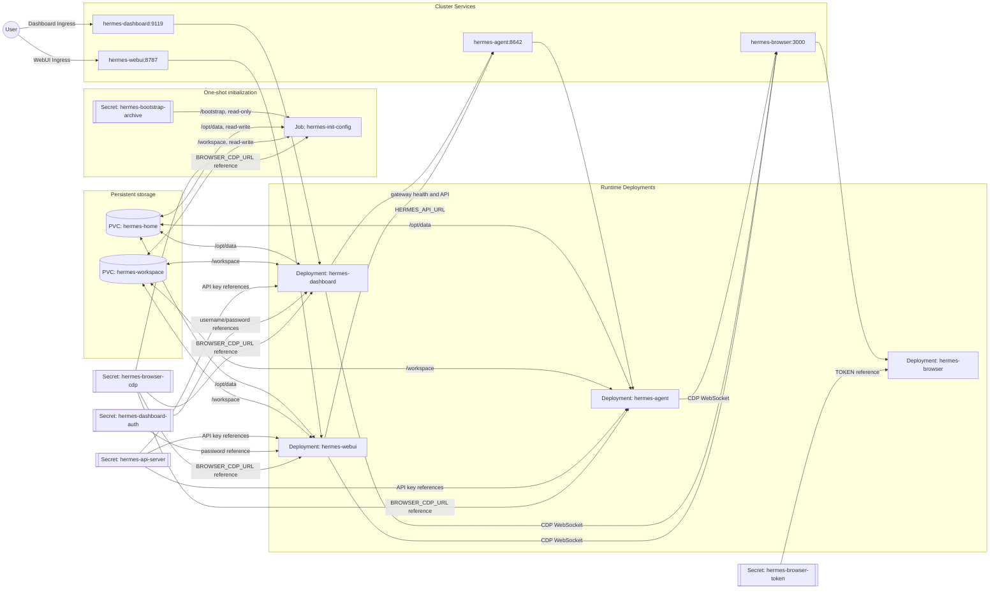

# PVC and container architecture

This document explains how the rendered Kubernetes resources share persistent storage, which paths each container sees, what is expected to live on each volume, and which environment variables wire the containers together.

The examples describe a full installation with Agent, Dashboard, WebUI, and Browserless enabled. The renderer omits disabled Dashboard, WebUI, and Browserless resources. Ansible and SSH are feature gates inside retained workloads, so related variables or conditional initialization logic can remain in the manifest even when those features are disabled; Node.js, npm, and npx are always installed and are not gated. Always inspect the exact output in `current_config/artifacts/hermes.yaml` for a specific installation.

## Application wiring



The arrows show references and network/storage relationships, not Secret values. The renderer keeps credential values out of the PodSpec and loads them through `secretKeyRef`; do not expose a Secret with `kubectl` output. Browserless has no PVC and is intentionally stateless. Browser sessions disappear when its Pod restarts; durable filesystem state remains on the two PVCs, while Kubernetes Secrets are separate durable cluster state.

## PVC mount matrix

| PVC | Access mode | Init Job | Agent | Dashboard | WebUI | Browserless |
|---|---|---|---|---|---|---|
| `hermes-home` | `ReadWriteOnce` | `/opt/data` RW | `/opt/data` RW | `/opt/data` RW | `/opt/data` RW | Not mounted |
| `hermes-workspace` | `ReadWriteOnce` | `/workspace` RW | `/workspace` RW | `/workspace` RW | `/workspace` RW | Not mounted |

Both claims use the configured storage class and sizes (`STORAGE_CLASS_NAME`, `HERMES_HOME_STORAGE_SIZE`, and `HERMES_WORKSPACE_STORAGE_SIZE`). `ReadWriteOnce` means a claim may be mounted read-write by Pods on one node. A storage backend or scheduling change that places these Pods on different nodes must still satisfy that constraint.

The init Job and PVC-consuming application Pods use the configured `HERMES_RUNTIME_GID` as `fsGroup` with `fsGroupChangePolicy: OnRootMismatch`; the bundled default is `10000`. Browserless does not need that group because it mounts neither PVC. Volume-driver support determines how `fsGroup` is applied; the Job's recursive `chown` to the configured runtime UID/GID is the stronger ownership normalization. Application init containers then normalize writable directories and security-sensitive modes before the main process starts.

### Non-PVC mounts

| Workload/container | Source | Mount | Lifetime and purpose |
|---|---|---|---|
| `hermes-init-config/init` | Secret `hermes-bootstrap-archive` | `/bootstrap` read-only | Compressed bootstrap input used by the one-shot Job; not persistent filesystem storage. |
| `hermes-agent/prepare-permissions` | Both PVCs | `/opt/data` and `/workspace` RW | Restores ownership and security-sensitive modes before Agent starts. |
| `hermes-dashboard/prepare-permissions` | Both PVCs | `/opt/data` and `/workspace` RW | Restores ownership and security-sensitive modes before Dashboard starts. |
| `hermes-webui/prepare-webui-state` | Both PVCs | `/opt/data` and `/workspace` RW | Prepares WebUI state and restores ownership/modes. |
| `hermes-webui/copy-agent-source` | `emptyDir` `hermes-agent-src` | `/agent-src` RW | Copies the Agent source bundled in the Agent image. |
| `hermes-webui/prepare-browser-cli` | PVC `hermes-home` | `/opt/data` RW | Builds and validates a complete Node/npm/npx runtime off-path, then atomically activates it through `/opt/data/node/current` and refreshes the browser dependency symlink. |
| `hermes-webui/hermes-webui` | `emptyDir` `hermes-agent-src` | `/home/hermeswebui/.hermes/hermes-agent` read-only | Makes the copied Agent implementation available to WebUI chat sessions. Recreated with the Pod. |

## What resides on `hermes-home`

`hermes-home` is the shared persistent Hermes home. All three Hermes application containers set `HERMES_HOME`, `HOME`, and `CODEX_HOME` to `/opt/data` so Hermes and the Codex CLI share the persisted OAuth state at `/opt/data/auth.json`.

| Path under `/opt/data` | Purpose | Sensitivity |
|---|---|---|
| `config.yaml` | Native Hermes provider, model, terminal, display, gateway, and tool configuration. | Configuration; may reveal operational settings. |
| `.env` | Runtime credentials and environment secrets, including the managed Browserless CDP URL. | **Secret**; never commit, print, or include in diagnostics. |
| `auth.json` | OAuth credential pools such as OpenAI Codex authorization. | **Secret**; persists across Pod restarts and reinstallations. |
| `SOUL.md` | Agent role and behavior policy. | May contain organization-specific instructions. |
| `memories/` | Persistent user and Agent memories. | Potentially confidential. |
| `skills/` and `plugins/` | Installed reusable procedures and extensions. | Review before sharing publicly. |
| `cron/` | Scheduled-job definitions and execution state. | May contain internal prompts or delivery metadata. |
| `state.db`, `response_store.db`, `kanban.db` and related state | Common examples of component-created session, response/tool, and application databases; exact paths are version-dependent. | Potentially confidential; back up and handle as application data. |
| `webui/` | WebUI state, session metadata, and WebUI-owned files. | Potentially confidential. |
| `.ssh/` | Persistent SSH identity, public key, config, and known hosts. | Private keys are **Secret**. Directory mode is `0700`; private keys/config are `0600`. |
| `hermes-managed/bin/` | Installer-managed wrapper directory. The persistent-config-aware `ssh` entry point exists only when SSH setup produced it. | Executable application support files. |
| `addon-venv/` | Persistent addon Python virtual environment. | Rebuildable, but persisted to avoid reinstalling on every Pod start. |
| `uv/` | Managed `uv` binary and Python installations. | Rebuildable toolchain cache/runtime. |
| `node/` | Validated Node/npm/npx runtimes under `runtimes/<hash>/`, integrity metadata, atomic `current` pointer, stable launchers under `bin/`, and optional private runtime library required by WebUI browser tools. Corrupt retained runtimes are rebuilt from the trusted Agent image before activation. | Rebuildable toolchain/runtime. |
| `node_modules` | PVC-resident symlink to the Agent dependency tree in WebUI's Pod-local `hermes-agent-src` `emptyDir`; refreshed on each WebUI Pod creation. | The symlink persists, but its target is recreated with the Pod. |
| `.config/`, `.cache/`, `.local/`, `.npm/` | XDG state, browser harness data/cache, user-local binaries, and NPX data. | May contain caches, session artifacts, or tool state. |
| `ansible/` | Ansible local temp files, SSH control sockets, and optionally installed collections/roles. | Runtime state; control sockets are ephemeral in meaning even though the directory is persistent. |
| `home/` and `.profile` | Installer-managed login-shell environment hooks used by terminal subprocesses. | Configuration only; do not place secrets in profile files. |

The exact set grows as Hermes tools and plugins create state. Backups therefore treat the complete `/opt/data` tree as application data rather than copying only the documented paths.

## What resides on `hermes-workspace`

`hermes-workspace` is mounted at `/workspace` in Agent, Dashboard, WebUI, and the init Job. It stores user-visible working data separately from Hermes configuration and credentials.

Typical content includes:

```text
/workspace/
├── AGENTS.md                 # workspace-level Agent instructions, when bootstrapped
├── ansible/                  # optional Ansible projects and configuration
│   ├── ansible.cfg
│   ├── collections/
│   ├── group_vars/
│   ├── host_vars/
│   ├── inventory/
│   ├── playbooks/
│   └── roles/
├── git/                      # active Git repositories, when created by workflows
└── <user task files>         # documents, code, plans, reports, and generated artifacts
```

All enabled Hermes interfaces see the same workspace files. A file created through Agent can therefore be inspected through Dashboard or WebUI, subject to each component's application-level access controls.

## Environment variables inside containers

The tables below document variables explicitly injected by this repository. Base images may define additional variables. Secret-backed variables show only their Kubernetes reference; their values must never appear in manifests or documentation.

### Shared Hermes runtime variables

| Variable | Agent | Dashboard | WebUI | Value/source |
|---|:---:|:---:|:---:|---|
| `HERMES_HOME` | Yes | Yes | Yes | `/opt/data` |
| `HOME` | Yes | Yes | Yes | `/opt/data` |
| `CODEX_HOME` | Yes | Yes | Yes | `/opt/data`; makes the Codex CLI use persistent `/opt/data/auth.json` |
| `XDG_CONFIG_HOME` | Yes | Yes | Yes | `/opt/data/.config` |
| `XDG_CACHE_HOME` | Yes | Yes | Yes | `/opt/data/.cache` |
| `LANG`, `LC_ALL` | Yes | Yes | Yes | `C.UTF-8` |
| `HERMES_WRITE_SAFE_ROOT` | Yes | Yes | Yes | `/opt/data:/workspace` |
| `HERMES_ADDON_PYTHON_MODE` | Yes | Yes | Yes | Configured addon Python mode, normally `uv` |
| `HERMES_UV_DIR` | Yes | Yes | Yes | `/opt/data/uv` |
| `HERMES_ADDON_VENV` | Yes | Yes | Yes | `/opt/data/addon-venv` |
| `HERMES_ADDON_PYTHON_VERSION` | Yes | Yes | Yes | Configured Python version |
| `UV_PYTHON_INSTALL_DIR` | Yes | Yes | Yes | `/opt/data/uv/python` |
| `UV_CACHE_DIR` | Yes | Yes | Yes | `/opt/data/.cache/uv` |
| `ANSIBLE_CONFIG` | Yes | Yes | Yes | `/workspace/ansible/ansible.cfg` when Ansible is enabled/configured |
| `PATH` | Yes | Yes | Yes | Prepends the managed-wrapper directory and includes addon Python, `uv`, user-local binaries, and component-specific paths; the SSH wrapper itself exists only when SSH setup produced it |
| `BROWSER_CDP_URL` | Yes | Yes | Yes | Secret `hermes-browser-cdp`, key `BROWSER_CDP_URL`; the reference remains in retained Hermes workloads even when the Browserless Deployment is disabled |

Agent's `PATH` also includes the Agent image runtime, and WebUI's `PATH` additionally contains `/opt/data/node/bin` and `/opt/data/node_modules/.bin`, which is how WebUI chat sessions find the browser CLI installed by `prepare-browser-cli`. The WebUI Deployment does not override `LD_LIBRARY_PATH`; the persistent Node launcher prepends its private library directory for Node processes only and preserves any loader path inherited from a custom WebUI image.

### Agent-only variables

| Variable | Value/source |
|---|---|
| `npm_config_yes` | `true`; permits non-interactive npx execution. |
| `API_SERVER_ENABLED` | `true` |
| `API_SERVER_HOST` | `0.0.0.0` |
| `API_SERVER_PORT` | `8642` |
| `API_SERVER_KEY` | Secret `hermes-api-server`, key `api-key` |

### Dashboard-only variables

| Variable | Value/source |
|---|---|
| `HERMES_DASHBOARD_FILES_ROOT` | `/workspace` |
| `HERMES_DASHBOARD_BASIC_AUTH_USERNAME` | Secret `hermes-dashboard-auth`, key `username` |
| `HERMES_DASHBOARD_BASIC_AUTH_PASSWORD` | Secret `hermes-dashboard-auth`, key `password` |
| `GATEWAY_HEALTH_URL` | `http://hermes-agent:8642` |
| `API_SERVER_KEY` | Secret `hermes-api-server`, key `api-key` |

### WebUI-only variables

| Variable | Value/source |
|---|---|
| `HERMES_WEBUI_HOST` | `0.0.0.0` |
| `HERMES_WEBUI_PORT` | `8787` |
| `HERMES_WEBUI_STATE_DIR` | `/opt/data/webui` |
| `HERMES_WEBUI_AGENT_DIR` | `/home/hermeswebui/.hermes/hermes-agent` (read-only `emptyDir` mount populated by an init container) |
| `HERMES_WEBUI_AUTO_INSTALL` | `1` |
| `HERMES_NIX_BUILD` | `1` |
| `HERMES_WEBUI_PASSWORD` | Secret `hermes-dashboard-auth`, key `password` |
| `HERMES_WEBUI_MAX_UPLOAD_MB` | Configured upload limit |
| `HERMES_API_URL` | `http://hermes-agent:8642` |
| `HERMES_API_KEY` | Secret `hermes-api-server`, key `api-key` |
| `WANTED_UID`, `WANTED_GID` | Configured Hermes runtime UID/GID |

### Browserless variables

| Variable | Value/source |
|---|---|
| `PORT` | `3000` |
| `HOST` | `0.0.0.0` |
| `TOKEN` | Secret `hermes-browser-token`, key `token` |
| `CONCURRENT` | Configured maximum concurrent sessions |
| `QUEUED` | Configured maximum queued sessions |
| `TIMEOUT` | Configured session timeout in milliseconds |

### Init Job variables

| Variable | Purpose/source |
|---|---|
| `HERMES_BOOTSTRAP_MODE` | Selects `missing`, `overwrite`, or `disabled` bootstrap behavior. |
| `HERMES_ADDON_PYTHON_MODE` | Selects addon Python provisioning mode. |
| `HERMES_UV_DIR` | Persistent `uv` installation path. |
| `HERMES_ADDON_VENV` | Persistent addon virtual environment path. |
| `HERMES_ADDON_PYTHON_VERSION` | Python version installed for addons. |
| `UV_PYTHON_INSTALL_DIR` | Persistent managed Python path. |
| `UV_CACHE_DIR` | Persistent `uv` cache path. |
| `LANG`, `LC_ALL` | Locale used during initialization. |
| `HERMES_SSH_SETUP` | Enables persistent SSH setup. |
| `HERMES_SSH_GENERATE_KEY` | Allows first-key generation only when no configured key exists. |
| `HERMES_SSH_KEY_TYPE` | SSH key algorithm, normally `ed25519`. |
| `HERMES_SSH_KEY_PATH` | Persistent identity path, normally `/opt/data/.ssh/id_ed25519`. |
| `BROWSER_CDP_URL` | Secret `hermes-browser-cdp`, key `BROWSER_CDP_URL`; written into protected runtime configuration without printing it. |

## Persistence and failure boundaries

- Restarting Agent, Dashboard, or WebUI does not remove `/opt/data` or `/workspace` data.
- Reinstalling with the same PVCs preserves OAuth, SSH, sessions, skills, memories, and workspace files unless an explicitly destructive bootstrap/maintenance operation replaces them.
- Restarting Browserless terminates active browser sessions because it has no PVC.
- The `hermes-agent-src` `emptyDir` is recreated on every WebUI Pod start; the init container repopulates it before WebUI starts.
- Kubernetes Secrets are separate from PVCs. Back up both the PVC payload and repository-owned Kubernetes resources for application recovery. Externally managed TLS Secrets, storage infrastructure, ingress controllers, DNS, and other cluster dependencies require separate recovery procedures.
- Because all enabled Hermes interfaces share writable PVCs, application-level mistakes can affect shared state. Use backups before destructive maintenance and keep filesystem permissions restrictive.

## Inspect a rendered installation

The rendered manifest is the authoritative view for a particular configuration:

```bash
./configure.sh --no-install
# Inspect without printing Secret values:
kubectl apply --dry-run=client -f current_config/artifacts/hermes.yaml
```

After installation, these commands show names and references without decoding Secrets:

```bash
kubectl -n <namespace> get pvc
kubectl -n <namespace> get deploy,job
kubectl -n <namespace> get deploy hermes-agent hermes-dashboard hermes-webui -o yaml
```

Do not use `kubectl get secret ... -o yaml` in logs or shared terminals: base64 encoding is not encryption.
